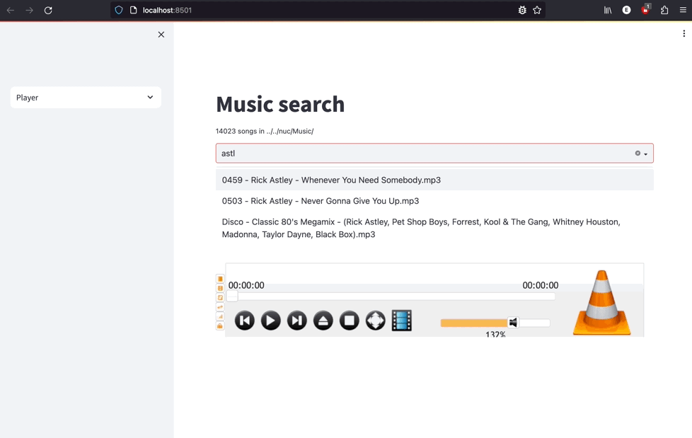

# Music player



An MP3 player in Streamlit?

```
$ streamlit run Music.py -- path/to/mp3/dir

  You can now view your Streamlit app in your browser.

  Local URL: http://localhost:8501
  Network URL: http://192.168.0.129:8501

VLC media player 3.0.20 Vetinari (revision 3.0.20-0-g6f0d0ab126)
[00007fac1d10e530] [http] lua interface: Lua HTTP interface
```
